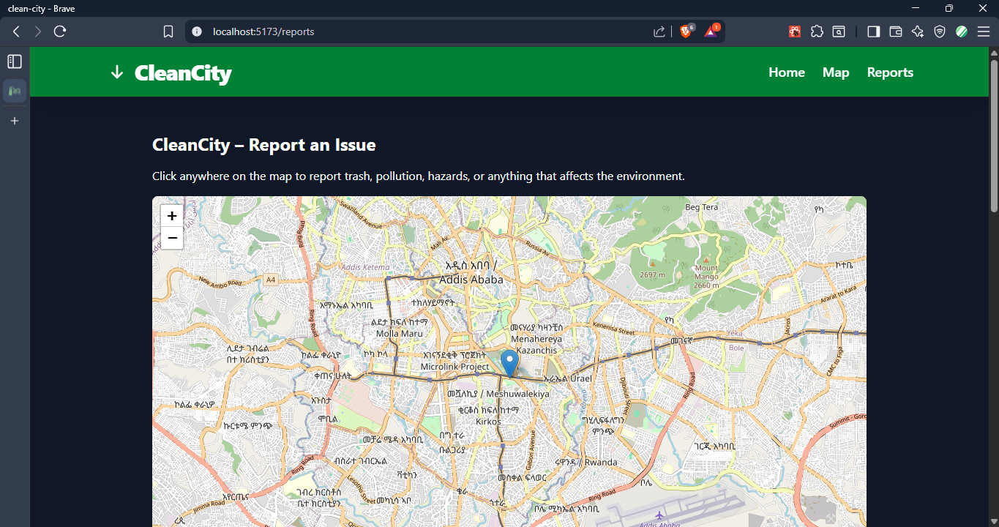

# Clean City

## Screenshot


## Overview
Clean City is a simple reporting app that lets users click a location on the map, attach an image, and submit an environmental report.

Frontend is deployed on Vercel: https://clean-city-l9tfceiqg-robels-projects-a70f5979.vercel.app/
Backend is deployed on Render.

## Features
- Interactive map using Leaflet.
- Users can select a spot and report an issue.
- Image upload using Multer.
- MongoDB database for saving reports.
- Fully deployed frontend and backend.

## Tech Stack
- **Frontend:** React, Vite, Leaflet, TailwindCSS
- **Backend:** Node.js, Express, Multer
- **Database:** MongoDB
- **Deployment:** Vercel (frontend), Render (backend)

## Project Structure
```
client/
  src/
    components/
    pages/
    App.jsx
    main.jsx
server/
  src/
    routes/
    models/
    controllers/
    server.js
```

## How It Works
1. User clicks a location on the map.
2. A form opens for title, description, and image.
3. Frontend sends a POST request with FormData.
4. Backend saves the info, uploads the file, and returns the created report.

## API Endpoints
### POST /api/reports
Creates a new report.

### GET /api/reports
Returns all existing reports.

## Deployment
- Push frontend to Vercel.
- Backend to Render with build command and start command.
- Ensure CORS is correctly set.

## Future Improvements
- Add authentication.
- Display reports on the map.
- Add filters for trash, pollution, etc.
- Improve UI with animations and better layout.

## License
MIT